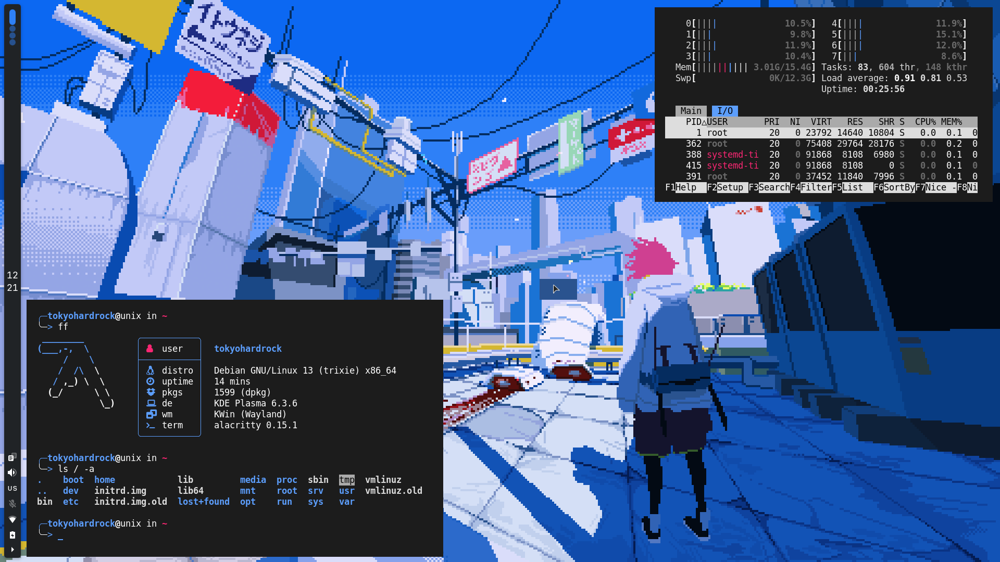

# my config
Here is a short guide on how to achieve this look on the **GNOME** desktop.


**1. [Graphite GTK Theme](https://github.com/vinceliuice/Graphite-gtk-theme)**

I used this command for installation, but I recommend reading the installation guide first:
```
./install.sh -c dark -g -l --tweaks rimless float normal --round 15px
```
**2. GNOME Extensions**
- [Advanced Weather Companion](https://github.com/Sanjai-Shaarugesh/Advanced-Weather-Companion)
- Extension to reduce some annoying UI elements - [Just Perfection](https://gitlab.gnome.org/jrahmatzadeh/just-perfection)
- [Pinned Apps in AppGrid](https://github.com/brunos3d/pinned-apps-in-appgrid)
- Music player - [Media Controls](https://github.com/sakithb/media-controls)
- Useful if you use more than one keyboard layout - [Primary Input on LockScreen](https://gitlab.com/sagidayan/primary-input-on-lockscreen)
- Displaying CPU temperature, voltage, fan speed, etc - [Vitals](https://github.com/corecoding/Vitals)

**3. Terminal**

I use the [BlackBox](https://github.com/yonasBSD/blackbox-terminal) terminal emulator with [Starship](https://starship.rs/) and my monochrome Tilix theme.

And that's pretty much it! There are more configs in this repo that I didn’t mention in the README, like LibreWolf config, neofetch, etc. But, i think there are no problems to install it ;)

*P.S.*

*I'll also post all my future configs and discoveries that make my life easier and better here, so you can save this repo for updates!*
